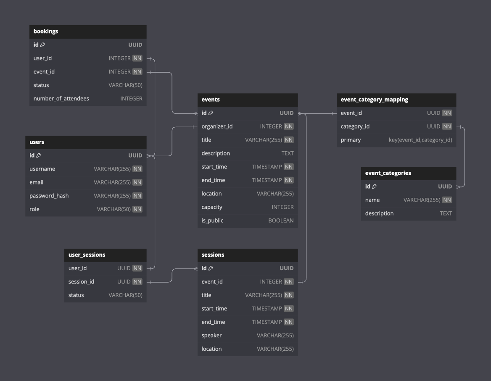

# conferenc

### Database Schema for Event Booking and Management Service

This schema defines the structure for a web-based application designed to manage event bookings and organization. Below are the SQL table definitions along with their purposes:

 `users`
- **`id`**: A unique identifier for each user (Primary Key).
- **`username`**: The user's chosen username.
- **`email`**: The user's email address. This field is unique across users.
- **`password_hash`**: A hashed version of the user's password for security.
- **`role`**: The role of the user in the system (e.g., Admin, Organizer, Attendee).

`events`
- **`id`**: A unique identifier for each event (Primary Key).
- **`organizer_id`**: The ID of the user who organizes the event (Foreign Key linked to `users`).
- **`title`**: The title of the event.
- **`description`**: A detailed description of the event.
- **`start_time`** and **`end_time`**: The start and end times of the event.
- **`location`**: The location where the event is held.
- **`capacity`**: The maximum number of attendees for the event.
- **`is_public`**: A boolean indicating if the event is public or private.

`bookings`
- **`id`**: A unique identifier for each booking (Primary Key).
- **`user_id`**: The ID of the user who made the booking (Foreign Key linked to `users`).
- **`event_id`**: The ID of the event being booked (Foreign Key linked to `events`).
- **`status`**: The status of the booking (e.g., Confirmed, Pending, Cancelled).
- **`number_of_attendees`**: The number of people included in the booking.

`sessions`
- **`id`**: A unique identifier for each session within an event (Primary Key).
- **`event_id`**: The ID of the event the session belongs to (Foreign Key linked to `events`).
- **`title`**: The title of the session.
- **`start_time`** and **`end_time`**: The start and end times of the session.
- **`speaker`**: The name of the speaker for the session.
- **`location`**: The location of the session within the event venue.

`user_sessions`
- Represents the registration of users to specific sessions within an event.
- **`user_id`** and **`session_id`**: Composite Primary Key, linking to `users` and `sessions` respectively.
- **`status`**: The attendance status (e.g., Registered, Attended, Missed).

`event_categories`
- **`id`**: A unique identifier for each category (Primary Key).
- **`name`**: The name of the category.
- **`description`**: A description of the category.

`event_category_mapping`
- Represents the many-to-many relationship between events and categories.
- **`event_id`** and **`category_id`**: Composite Primary Key, linking to `events` and `event_categories` respectively.

